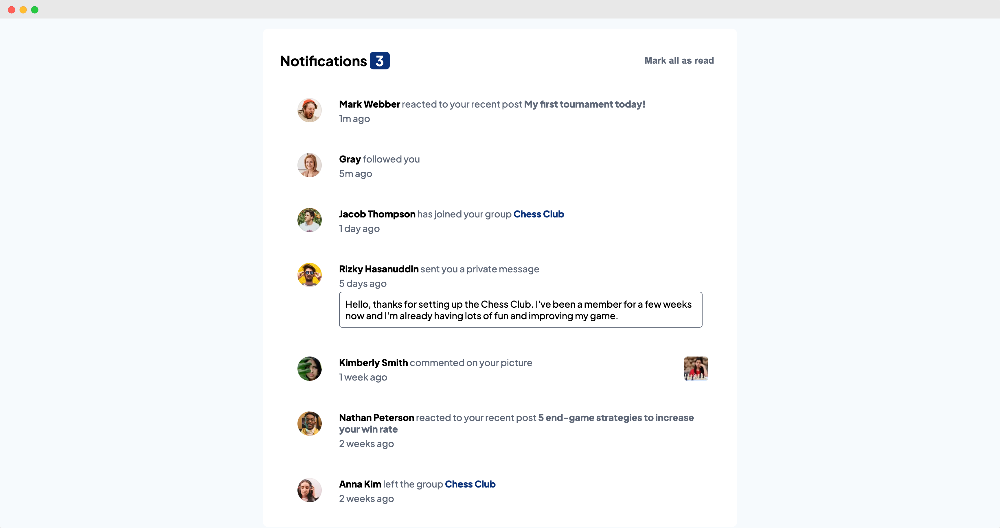

# Frontend Mentor - Notifications page solution

This is a solution to the [Notifications page challenge on Frontend Mentor](https://www.frontendmentor.io/challenges/notifications-page-DqK5QAmKbC). Frontend Mentor challenges help you improve your coding skills by building realistic projects. 

## Table of contents

- [Overview](#overview)
  - [The challenge](#the-challenge)
  - [Screenshot](#screenshot)
  - [Links](#links)
- [My process](#my-process)
  - [Built with](#built-with)
  - [What I learned](#what-i-learned)
  - [Where I improved my skills](#where-i-imporved-my-skills)
- [Author](#author)

**Note: Delete this note and update the table of contents based on what sections you keep.**

## Overview

    This is a [**Frontend Mentor**](https://www.frontendmentor.io/) challenge to practice website layout for both Desktop and Mobile view 

### The challenge

Users should be able to:

- Distinguish between "unread" and "read" notifications
- Select "Mark all as read" to toggle the visual state of the unread notifications and set the number of unread messages to zero
- View the optimal layout for the interface depending on their device's screen size
- See hover and focus states for all interactive elements on the page

### Links

- Solution URL: [https://github.com/Lololosa4ka/notifications-page-main](https://github.com/Lololosa4ka/notifications-page-main)
- Live Site URL: [https://mofizik.github.io/notifications-page-main/](https://mofizik.github.io/notifications-page-main/)

## My process

Divide whole project into smaller pieces. In this case individual notification which include: Avatar, Heading, Date, Main text

### Built with

- Semantic HTML5 markup
- CSS custom properties
- Flexbox

### What I learned

- How to integrate **JavaScript** with **HTML**
- CSS Flexbox

### Where I imporved my skills

- Page layout
- CSS
- Writing better and cleaner code

## Author

- Frontend Mentor - [@Mofizik](https://www.frontendmentor.io/profile/Mofizik)
- Telegram - [@Mofizik](https://www.twitter.com/Mofizik)

